# AMYboard Accessories

Important: plug accessories into the FRONT-panel I2C jack, the side with the 3.5mm jacks, **not** the back "Tulip" I2C jack. The back jack is a separate I2C bus reserved for connecting AMYboard to a Tulip CC; accessories plugged in there will not be reachable from your code.

AMYboard has a front panel I2C port for plugging in accessories. These connect with a simple cable (GROVE connector) -- no soldering required.

The I2C bus (SCL=18, SDA=17, 400kHz) is available for connecting additional hardware:

```python
import amyboard
i2c = amyboard.get_i2c()

# Scan for connected devices
print(i2c.scan())

# Read/write registers on any I2C device
val = amyboard.read_register(addr, reg)
amyboard.write_register(addr, reg, val)
```

You can add more DACs, ADCs, displays, or sensors to expand AMYboard's capabilities.

**Note:** For the Adafruit units below, you'll need a [GROVE to Stemma QT Adapter Cable](https://www.adafruit.com/product/4528). They can be hard to find in-stock, but you can make one (or two) yourself if you have a soldering iron: Take an existing GROVE cable and an existing Stemma QT cable, cut them both in the middle, then connect the bare ends together. (Note that, for Grove cables, the SDA and SCL colors depend on manufacturer.  The ordering below should be correct, however, i.e. SCL is the "edge" cable).

|Signal|Stemma QT color|Grove color|
|--|--|--|
|GND|Black|Black|
|Vcc|Red|Red|
|SDA|Blue|White (Seeed) or Yellow (M5) or White (Adafruit)|
|SCL|Yellow|Yellow (Seeed) or White (M5) or Green (Adafruit)|


## Known compatible accessories

### Displays

 - 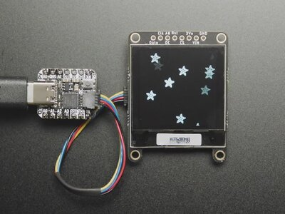  
   [**Adafruit Grayscale 1.5" 128x128 OLED Display (STEMMA QT)**](https://www.adafruit.com/product/4741) -- A high-contrast 128x128 grayscale OLED with 16 shades of gray. AMYboard has built-in support for this display, including waveform visualization. Connects directly via the STEMMA QT cable.

   The AMYboard front panel has a sized cutout for this display, with 4 M2 sized nut/bolt holes that will easily attach through the bolt holes on the display as well.
 - [**Generic SH1107 128x128 OLED displays (I2C)**](https://www.amazon.com/HiLetgo-SH1107-128x128-Display-Module/dp/B0CFF17DGH/) -- Many available generic displays based on the SH1107 or SSD1327 will work out of the box on AMYboard.
   
```python
import amyboard

# Initialize the display (auto-detects SSD1327 or SH1107)
amyboard.init_display()

# Draw text (x, y, color 0-255)
amyboard.display.text("Hello!", 0, 0, 255)
amyboard.display.text("AMYboard", 0, 16, 128)
amyboard.display_refresh()

# Draw shapes
amyboard.display.fill_rect(10, 40, 50, 20, 200)
amyboard.display_refresh()

# Show a live waveform visualization
amyboard.draw_waveform()
```

### Rotary encoders

 - 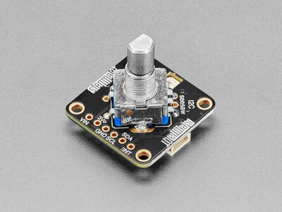  
   [**Adafruit I2C STEMMA QT Rotary Encoder Breakout**](https://www.adafruit.com/product/5880) -- A single rotary encoder with push button and NeoPixel LED, running seesaw firmware over I2C. Supports up to 8 on one I2C bus via address jumpers. AMYboard has built-in Python support for reading encoder position and button state.

```python
import amyboard

# Read encoder position (0-3)
pos = amyboard.read_encoder(encoder=0)

# Initialize and read encoder push buttons
amyboard.init_buttons()
buttons = amyboard.read_buttons()
# Returns tuple of 4 booleans (True = pressed)

# Drive the single on-board NeoPixel. The defaults target the Quad
# breakout, so pass the 5880's seesaw address (0x36) and NeoPixel pin (6).
amyboard.init_neopixels(num=1, pin=6, seesaw_dev=0x36)
amyboard.set_neopixel(0, 0, 64, 0, seesaw_dev=0x36)  # dim green
amyboard.show_neopixels(seesaw_dev=0x36)

# Monitor all encoders on the OLED display
amyboard.monitor_encoders()
```

 - 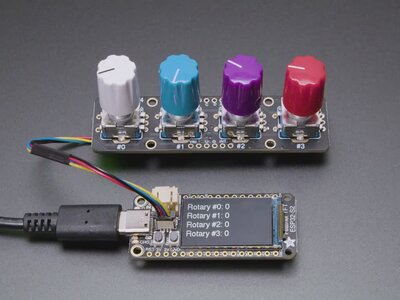  
   [**Adafruit I2C QT Quad Rotary Encoder Breakout**](https://www.adafruit.com/product/5752) -- Four rotary encoders with built-in push buttons and one RGB NeoPixel per encoder on a single I2C breakout, running seesaw firmware. AMYboard has built-in support via `read_encoder()`, `init_buttons()`, `read_buttons()`, and `init_neopixels()`/`set_neopixel()`/`show_neopixels()`. With a display connected, you can use `patch_selector()` to scroll through your `.patch` files with one encoder and load them with a click.

```python
import amyboard

# Read any of the 4 encoders (0-3)
pos = amyboard.read_encoder(encoder=0)

# Initialize and read all 4 push buttons
amyboard.init_buttons()
buttons = amyboard.read_buttons()
# Returns list of 4 booleans (True = pressed)

# Drive the 4 on-board NeoPixels (one per encoder).
# Defaults match this breakout (num=4, pin=18, seesaw_dev=0x49).
amyboard.init_neopixels()
amyboard.set_neopixel(0, 64, 0, 0)   # encoder 0 -> dim red
amyboard.set_neopixel(1, 0, 64, 0)   # encoder 1 -> dim green
amyboard.set_neopixel(2, 0, 0, 64)   # encoder 2 -> dim blue
amyboard.set_neopixel(3, 32, 32, 0)  # encoder 3 -> dim yellow
amyboard.show_neopixels()            # latch staged colors to the LEDs

# Patch selector: scroll through patches and load on click
# (requires a display to be connected)
amyboard.init_display()
amyboard.patch_selector()
```

 - 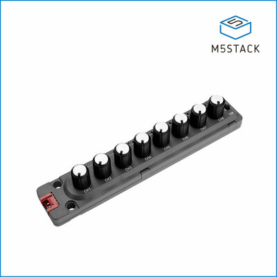  
   [**M5Stack 8-Encoder Unit (STM32F030)**](https://shop.m5stack.com/products/8-encoder-unit-stm32f030) -- Eight rotary encoders with RGB LEDs and a toggle switch, all on one I2C unit. Great for controlling multiple synth parameters at once.

```python
import m5_8encoder

# Cumulative position of each encoder (-2**31 to +2**31)
positions = m5_8encoder.read_all_counters()

# Push-button state for each encoder (0 = up, 1 = pressed)
buttons = m5_8encoder.read_all_buttons()

# Toggle switch on the side (0 or 1)
switch = m5_8encoder.read_switch()

# Light up encoder 0's LED red
m5_8encoder.set_led(0, bytes([255, 0, 0]))
```

### Knobs and joysticks

 - 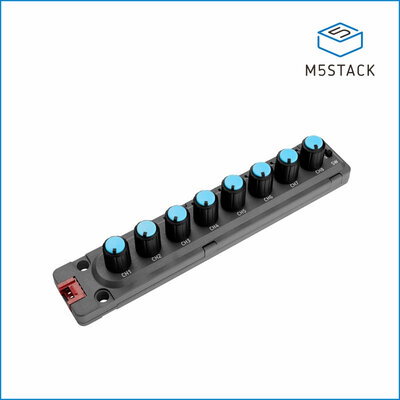  
   [**M5Stack 8-Angle Unit**](https://shop.m5stack.com/products/8-angle-unit-with-potentiometer) -- Eight potentiometer knobs on one I2C unit. Each knob reads as a float 0.0--1.0.

```python
import m58angle

# Read knob 0 (range 0.0 to 1.0)
val = m58angle.get(0)

# Map all 8 knobs to AMY synth parameters
import amy
for ch in range(8):
    amy.send(osc=ch, amp=m58angle.get(ch))
```

 - 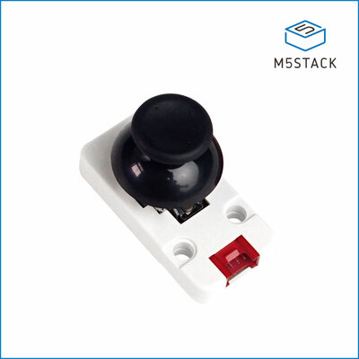  
   [**M5Stack I2C Joystick**](https://shop.m5stack.com/products/i2c-joystick-unit-v1-1-mega8a) -- Two-axis analog stick with a push-button.

```python
import m5joy

# Returns (x, y, button) -- x and y are 0.0..1.0, button is 0/1
x, y, btn = m5joy.get()
```

### Analog I/O (DAC, ADC, CV)

These units pair well with AMYboard's CV outputs for driving modular gear, or for reading sensors. See [Modular Synth Setup](modular.md) for more on CV.

 - 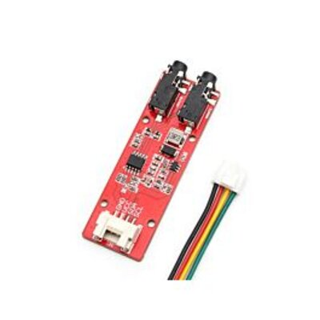  
   [**Mabee DAC (GP8413, dual channel up to 10V)**](https://www.makerfabs.com/mabee-dac-gp8413.html) -- Two CV outputs per unit, up to four units (8 channels) on one bus by changing the address jumpers.

```python
import mabeedac

# Set channel 0 to 5.0 V
mabeedac.set(5.0, channel=0)
mabeedac.set(2.5, channel=1)
```

 - 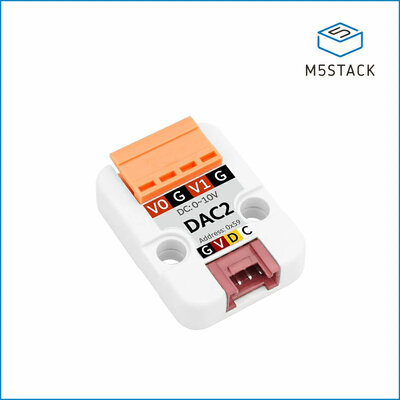  
   [**M5Stack DAC2 Unit (GP8413, dual channel up to 10V)**](https://shop.m5stack.com/products/dac-2-i2c-unit-gp8413) -- Same chip as the Mabee DAC, in an M5 enclosure.

```python
import m5dac2

m5dac2.set(7.5, channel=0)
m5dac2.set(0.0, channel=1)
```

 - 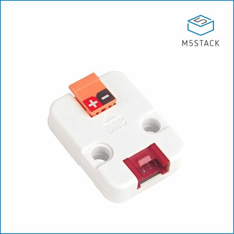  
   [**M5Stack DAC Unit (single channel, up to 3.3V)**](https://shop.m5stack.com/products/dac-unit) -- One 12-bit output, 0--3.3V.

```python
import m5dac

m5dac.set(1.65)  # half-scale
```

 - 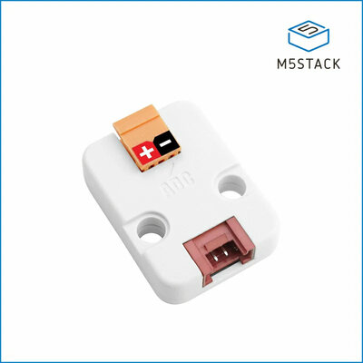  
   [**M5Stack ADC Unit (ADS1100, up to 12V)**](https://shop.m5stack.com/products/adc-i2c-unit-v1-1-ads1100?variant=44321440399617) -- Read external voltages (e.g. a CV input) up to 12V.

```python
import m5adc

volts = m5adc.get()
print(volts)
```

### General-purpose I/O

 - 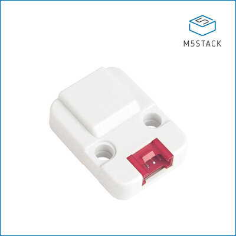  
   [**M5Stack Extend I/O Unit (PCA9554PW)**](https://shop.m5stack.com/products/official-extend-serial-i-o-unit) -- 8 GPIO pins over I2C, each configurable as input or output.

```python
import m5extend

# Configure pin 0 as output, drive it high
m5extend.set_pin_mode(0, False)   # False = output
m5extend.write_pin(0, True)

# Configure pin 1 as input, read it
m5extend.set_pin_mode(1, True)    # True = input
state = m5extend.read_pin(1)
```

### Clocks

 - 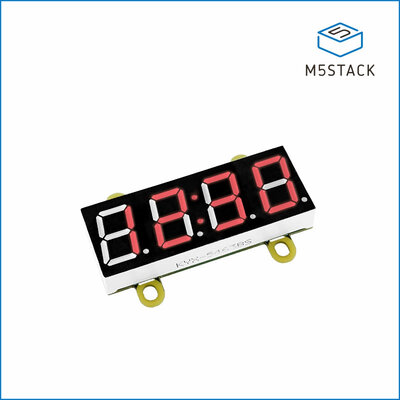  
   [**M5Stack 7-Segment Digi-Clock Unit**](https://shop.m5stack.com/products/red-7-segment-digit-clock-unit) -- Four red 7-segment digits over I2C. Pass a 4-character string.

```python
import m5digiclock

m5digiclock.set("1234")
m5digiclock.set("AMY ")
```

## Connecting accessories

All accessories plug into the front panel I2C port. You can daisy-chain multiple I2C devices together.

```python
import amyboard

# Scan the I2C bus to see connected accessories
i2c = amyboard.get_i2c()
print(i2c.scan())
```


See [Using Python](python.md) and [Modular Synth Setup](modular.md) for more on using I2C devices with AMYboard.

[Back to Getting Started](README.md)
