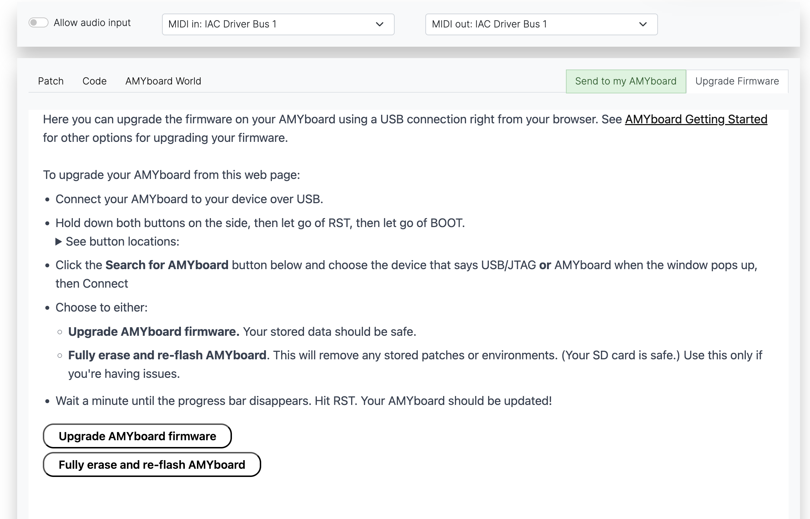
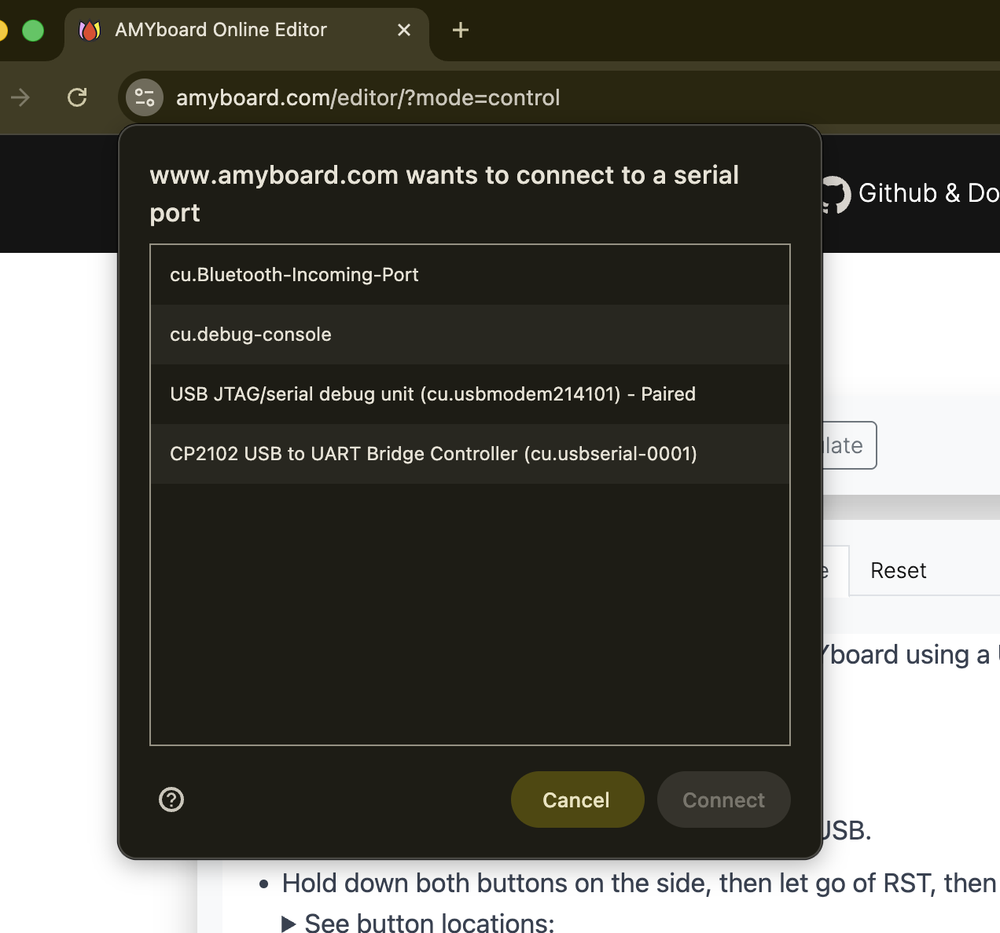

# Upgrading your Firmware

There are three ways to upgrade the firmware on your AMYboard. The easiest is using the web-based upgrader.

---

## Option 1: AMYboard Online firmware upgrader (easiest)

The [AMYboard Online editor](https://amyboard.com/editor) includes a built-in firmware upgrader that works right from your browser using WebSerial. We recommend using Google Chrome for this. 

1. Connect your AMYboard to your computer over USB.
2. Hold down both buttons on the side of the AMYboard, then release RST first, then release BOOT. This puts the board into bootloader mode.
3. Open the firmware upgrade page and click **Search for AMYboard**.



4. Choose the serial port that corresponds to your AMYboard (it shows up as "USB JTAG/serial debug unit")



5. Choose to either **Upgrade AMYboard firmware** (keeps your files) or **Fully erase and re-flash AMYboard** (fresh start).
6. Wait for the process to complete. You then need to hit BOOT, then RST to restart your AMYboard into the upgraded firmware!

---

## Option 2: Over-the-air upgrade via serial

If your AMYboard is already running and you can connect to it over serial, you can upgrade over Wi-Fi.

Connect to your AMYboard's serial console using one of:

```bash
mpremote connect /dev/YOUR_SERIAL_PORT
```

or:

```bash
screen /dev/YOUR_SERIAL_PORT 115200
```

Then at the MicroPython prompt, connect to Wi-Fi and run the upgrade:

```python
>>> import amyboard
>>> amyboard.wifi('your_ssid', 'your_password')
>>> amyboard.upgrade()
```

The upgrade will download the latest firmware and system files over Wi-Fi. Your saved files are preserved. The board will reboot when finished.

---

## Option 3: Flash downloaded firmware with esptool

If your AMYboard won't boot or you need a completely fresh flash, you can use `esptool` to write the full firmware image directly.

1. Download the latest `amyboard-full-AMYBOARD.bin` from the [releases page](https://github.com/shorepine/tulipcc/releases/latest).

2. Connect your AMYboard over USB and put it in bootloader mode (hold both buttons, release RST first, then BOOT).

3. Install `esptool` if you haven't already, and flash the image:

```bash
pip install esptool
esptool.py write_flash 0x0 amyboard-full-AMYBOARD.bin
```

**Note: This will erase everything on the board, including any saved files.**

The AMYboard should reboot when flashing is complete (you may need to unplug and replug the USB cable). After this initial flash, you can use `amyboard.upgrade()` or the web firmware upgrader for future updates.

---

## Option 4: Compile and flash locally

If you edit the AMY or AMYboard software and want to flash your locally-modified version, you can recompile on your machine.

1. Make sure you have `esp-idf` installed correctly, see the instructions for [reflashing the TulipCC](https://github.com/shorepine/tulipcc/blob/main/docs/tulip_flashing.md#compile-and-flash-tulipcc-for-esp32-s3).

2. Connect your AMYboard over USB and put it in bootloader mode (hold both buttons, release RST first, then BOOT).

3. Move to the `tulip/amyboard` directory and run `idf.py flash`.  This should automatically find your AMYboard's serial connection, recompile the firmware, and write it to the AMYboard. (If it has trouble finding your AMYboard, you can try adding `-p /dev/cu.usbmodem.XXXX` or similar to explicitly specify the AMYboard's serial connection.)

4. Press RST on the AMYboard to reboot it.  It should then work normally.

5. You can open a serial connection to the AMYboard serial port to directly interact with the MicroPython REPL (and possibly to see error messages): `screen /dev/cy.usbmodem.XXXX 115200`.  (`mpremote` does not work for AMYboard.)

6. If you need to rewrite the AMYboard file system (rare and slow, and removes any saved files you have written), it's `idf.py erase-flash` followed by `python amyboard_fs_create.py full`.


[Back to Getting Started](README.md)
