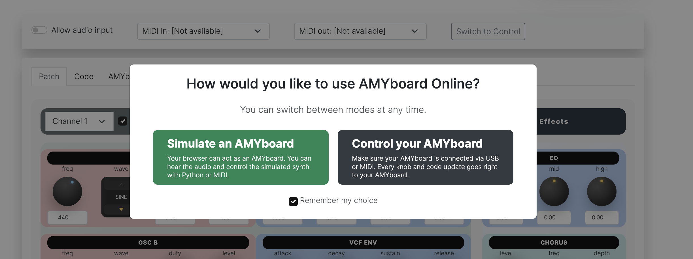
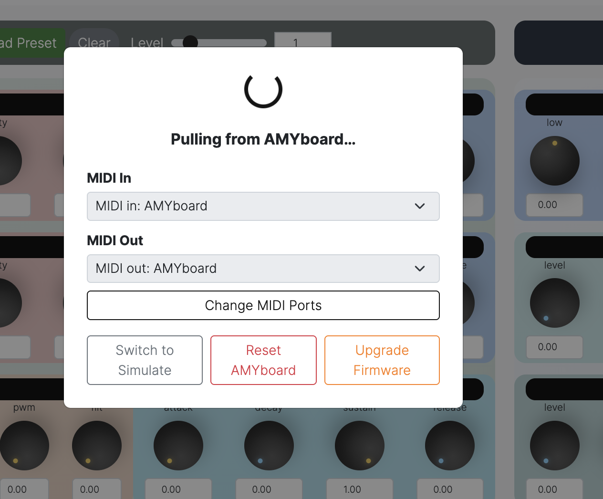
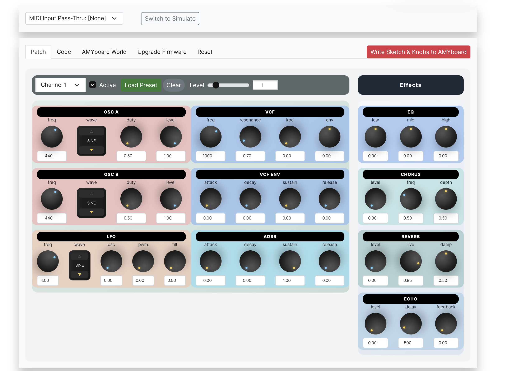
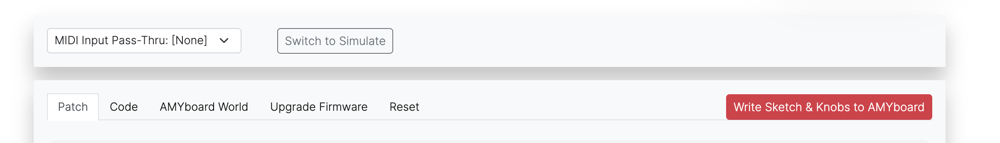
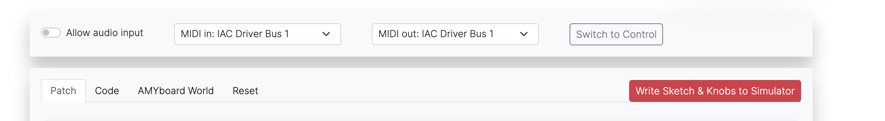
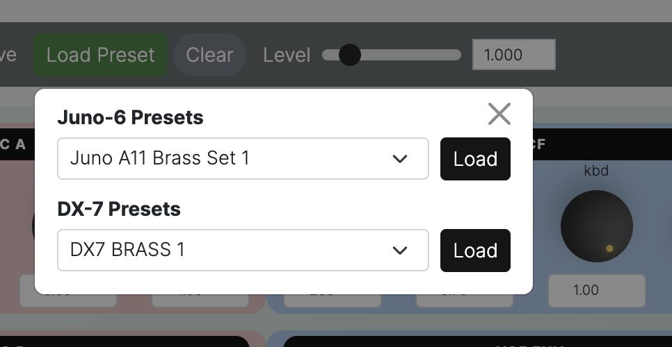
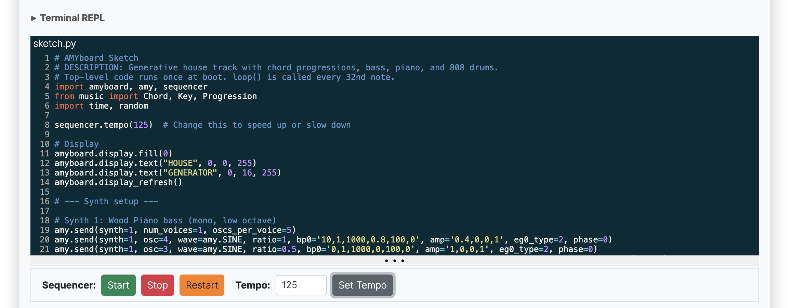
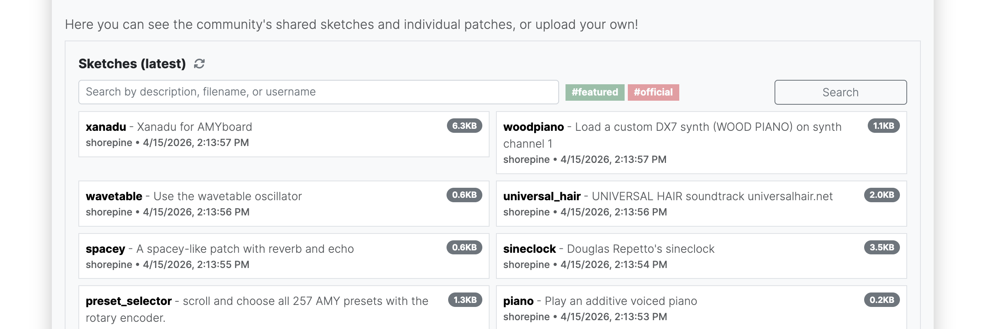

# Using AMYboard Online

The AMYboard web editor at [amyboard.com](https://amyboard.com/editor) lets you both simulate an AMYboard in your browser (and let you design sketches without an AMYboard on hand!) or control your own AMYboard directly over MIDI. You can also see shared sketches from AMYboard World. 

On first load, you'll see this. It's up to you if you want to simulate an AMYboard or control one you own.

## Control mode

**Before using AMYboard Online in control mode, make sure you've [upgraded your firmware](firmware.md).**

If you want Control mode, you should first ensure your AMYboard is connected to your computer via MIDI. 

You can use just the USB-C port directly -- it exposes a MIDI in and out port for you. If you're using USB-C MIDI, we'll detect it for you.

But if your USB-C port is not accessible or you'd rather use direct MIDI, you can choose the MIDI in and out ports that are connected to your AMYboard's MIDI out and in ports (remember to swap the directions -- your computer's MIDI out should be connected to AMYboard's MIDI in, and vice versa.) 

You'll see a brief "syncing" window while we pull the latest sketch and knob settings from your AMYboard over MIDI. If your AMYboard is not connected yet, do it now (and re-choose the MIDI port again.)

If the sync windows stays up a long time and you're sure you've got MIDI wired up properly, you may need to [reflash your firmware.](firmware.md)

Once it goes away you'll see the main AMYboard Online, with the knobs (described below) and a strip up top:

You can immediately start using your AMYboard. Click a note on the piano keyboard on screen and your AMYboard should respond. Move some knobs and they should respond on the AMYboard. 

Let's go through the rest of the page:

The **MIDI Input Pass-Thru** lets you optionally choose _another MIDI in port on your computer_ to control AMYboard as well as the on-screen knobs and keyboard. This is a convenient way to both control and perform with AMYboard using the web page. It's optional to turn on. but if you have (for example) a MIDI controller hooked up to your computer, select it and you can play directly to the AMYboard.

"Switch to Simulate" moves to you Simulate mode. We'll cover that next.

The tabs on the top:

 - Patch - the knobs and settings per channel for the sythesizer
 - Code - the sketch file and control over the sequencer
 - AMYboard World - browse, download and upload your own sketches
 - Upgrade Firmware - [flash a new firmware](firmware.md) directly over the web
 - Reset - will reset and restart your AMYboard to defaults.

"Write Sketch & Knobs to AMYboard" - will replace what is running on the AMYboard with the current state as it is now. You want to do this if you want the AMYboard to sound the same when you next turn it off and on again. 

## Simulate Mode

If you choose simulate mode you will have an AMYboard running in your browser. It can make the same sounds and run the same sketches as a real AMYboard (there are a couple of small changes, but most people won't notice.) It's a great way to develop your AMYboard sketches away from your synth setup. 

The simulate page is slightly different:

- MIDI in and out - this is the MIDI ports of the simulated AMYboard. If you want to control the simulated AMYboard over MIDI, wire up your MIDI in port. If you want to have simulated AMYboard send MIDI out (using [wave=amy.MIDI](https://github.com/shorepine/amy/blob/main/docs/api.md), choose a MIDI out port as well. 
- Allow Audio Input - on web, you have to manually allow your browser to listen to your audio input. We only use this for AMY effects (e.g. amy.AUDIO_IN0) and sampling.
- Switch to Control - goes back to Control mode.

### The patch editor

The patch editor works the same in both modes. On simulate mode, remember, you're controlling a version of AMYboard running in your browser. In control mode, every knob changes the AMYboard itself in real time.

The channel strip up top lets you use different patches for each of 16 MIDI channels. 

| Control | Description |
|---------|-------------|
| **Channel 1** (dropdown) | Select which of the 16 independent synth channels to edit. Each channel has its own patch, MIDI assignment, and parameter set. |
| **Active** (checkbox) | Enable or disable this channel. Unchecking it silences the channel without losing its settings. |
| **Load Preset** (button) | Click to open the preset browser and load one of the 256 built-in presets into the current channel.  |
| **Clear** | Reset all knobs on this channel to their default values. |
| **Level** | Sets the relative volume of this channel |

If you click "Load Preset" you'll see the preset dropdown:

Under the channel strip are the knobs that can set the sound parameters.

The patch knob panel contains six sections organized into two columns. The left column (pink) controls the oscillators and LFO; the right column (blue) controls the filter and envelopes.

#### OSC A — Oscillator A

| Knob | Description |
|------|-------------|
| **freq** | Base frequency of oscillator A in Hz. Default 440 (concert A). |
| **wave** | Waveform selector. Click to cycle through: SINE, PULSE, SAW\_UP, SAW\_DOWN, TRIANGLE, NOISE, and more. |
| **duty** | Pulse width for PULSE waveform (0–1). Has no effect on other waveforms. |
| **level** | Output level (amplitude) of oscillator A (0–1). |

*When you select a wavetable waveform, the Wavetable Presets dropdown lets you choose from built-in wavetable files.*

#### OSC B — Oscillator B

| Knob | Description |
|------|-------------|
| **freq** | Base frequency of oscillator B in Hz. Default 220 (one octave below OSC A). Detune this slightly from OSC A for a thicker sound. |
| **wave** | Waveform selector for oscillator B. Independent of OSC A. |
| **duty** | Pulse width for oscillator B PULSE waveform. |
| **level** | Output level of oscillator B (0–1). |

#### LFO — Low Frequency Oscillator

| Knob | Description |
|------|-------------|
| **freq** | LFO rate in Hz. Typical values are below 10 Hz for vibrato/tremolo effects. |
| **wave** | LFO waveform (TRIANGLE, SINE, SAW, PULSE, etc.). |
| **osc** | How much the LFO modulates oscillator pitch (0–1). Creates vibrato. |
| **pwm** | How much the LFO modulates pulse width of OSC A and B (0–1). Creates pulse-width modulation. |
| **filt** | How much the LFO modulates the VCF cutoff frequency (0–1). Creates filter wobble. |

#### VCF — Voltage-Controlled Filter

| Knob | Description |
|------|-------------|
| **freq** | Filter cutoff frequency in Hz. Lower values make the sound darker/bassier; higher values open the filter. |
| **resonance** | Filter resonance (Q factor, 0–1). Higher values create a sharper peak at the cutoff. Extreme values can cause clipping. |
| **kbd** | Keyboard tracking amount (0–1). At 1.0, the filter cutoff tracks your MIDI note so higher notes are brighter. |
| **env** | How much the VCF ENV (see below) modulates the filter cutoff. Higher values give more filter sweep per note. Negative values make filter sweep downwards on attack. |

#### VCF ENV — Filter Envelope

| Knob | Description |
|------|-------------|
| **attack** | Time (ms) for the filter envelope to rise to its peak after a note-on. |
| **decay** | Time (ms) for the filter envelope to fall from peak to sustain level. |
| **sustain** | The filter envelope level held while a key is held down (0–1). |
| **release** | Time (ms) for the filter envelope to fall from sustain to zero after note-off. |

#### ADSR — Amplitude Envelope

| Knob | Description |
|------|-------------|
| **attack** | Time (ms) for the note to reach full volume after note-on. |
| **decay** | Time (ms) for the volume to fall from peak to the sustain level. |
| **sustain** | Volume level held while a key is held (0–1). |
| **release** | Time (ms) for the note to fade to silence after note-off. |

The Effects panel (right side of the Patch tab) contains four global processors shared by all channels.

#### EQ — 3-Band Equalizer

| Knob | Description |
|------|-------------|
| **low** | Low-frequency (\< 800 Hz) shelf gain (dB). Positive boosts bass; negative cuts it. |
| **mid** | Mid-frequency gain (800 Hz - 7 kHz). |
| **high** | High-frequency (\> 7 kHz) shelf gain. Positive adds brightness; negative rolls off treble. |

#### Chorus

| Knob | Description |
|------|-------------|
| **level** | Chorus wet/dry mix (0–1). 0 = dry, 1 = full chorus. |
| **freq** | Chorus LFO rate. Higher values give a faster, more intense modulation. |
| **depth** | Chorus depth — how wide the pitch modulation swings. More depth = thicker, swimmy sound. |

#### Reverb

| Knob | Description |
|------|-------------|
| **level** | Reverb wet/dry mix (0–1). |
| **live** | Room size / decay time (0–1). Higher values give a longer, larger-sounding reverb tail. |
| **damp** | High-frequency damping of the reverb tail (0–1). Higher values make the reverb sound warmer and less harsh. |

#### Echo

| Knob | Description |
|------|-------------|
| **level** | Echo wet/dry mix (0–1). |
| **delay** | Echo delay time in milliseconds. |
| **feedback** | How much of the echo signal feeds back into itself (0–1). Higher values create longer, repeating echoes. Keep below 1 to avoid runaway feedback. |

### Setting MIDI CCs and Knob parameters

Click any knob **label** (the text above or below the knob, e.g. "freq") to open its parameter editor popup.

| Field | Description |
|-------|-------------|
| **min / max** | The real-world range this knob covers. For example, OSC A freq defaults to min 50 Hz / max 2000 Hz. Tighten this range to make the knob more precise over a smaller span of values. |
| **log** | When checked, the knob follows a logarithmic scale — useful for frequency and time parameters where large values are less perceptually important. |
| **MIDI CC (0-127)** | Assign a MIDI Continuous Controller number to this knob. When your controller sends that CC, the knob moves in real time. If empty no CC assignment is made. |
| **Learn** | Click Learn, then move a knob or fader on your MIDI controller. The CC number is detected automatically and filled in. |
| **Save / Cancel** | Save commits the new range and CC assignment. Cancel closes without changing anything. |

## Write and run Python sketches

When AMYboard starts up, either on web or hardware, it sets up whatever patches are set to each channel (using data stored in a sketch) and then runs a "sketch" set up in `sketch.py`. This is a Python program that runs setup code (in the top level of the code file) and then calls `loop()` periodically -- every 32nd note of the sequencer. 

The code tab of AMYboard online has a code editor. You should see a default `sketch.py` that you can edit. 

To run this code, you have to first write the sketch by clicking "Write Sketch & Knobs to (Simulator / AMYboard)."

Under the code editor you'll see "Start", "Stop", "Restart" and a sequencer tempo entry. Those will start/pause the loop() callback in your sketch. 

In simulate mode only you'll see a disclosure triangle for "Terminal REPL" - this gives you an in-browser Python REPL where you can type in your own Python commands. If you want this REPL in Control mode, you should [connect directly to your AMYboard](python.md) using serial connection. 

*The Terminal REPL gives you an interactive MicroPython prompt where you can type AMY commands and see results immediately.*

Also only in simulate mode, under the code editor is a row of simulated [AMYboard accessories](accessories.md). This includes an OLED display, a rotary encoder with push button, and two CV input knobs. These help you verify your hardware hookups before deploying to a real AMYboard with acessories.

## AMYboard World

We provide a file sharing network for AMYboard called "AMYboard World." People can share their own sketches. It's up to you if you want to share your code with others, but we recommend it! Make sure to join us on our [Discord](https://discord.gg/TzBFkUb8pG) to let people know about your uploads. 

You can search or see everyone's uploaded sketches. They contain both patches and code. An online or hardware AMYboard runs a single sketch at a time. Click on an environment to replace your current setup with one from AMYboard World. 

You can upload your own environments or patches here. Choose a memorable username and describe your work!

[Back to Getting Started](README.md)
