# Using AMYboard Online

The AMYboard web editor at [amyboard.com](https://amyboard.com/editor) lets you design patches, write Python code, manage your AMYboard and see shared patches and code -- all from your browser. You can also use it as a standalone browser-based synthesizer without any hardware at all.

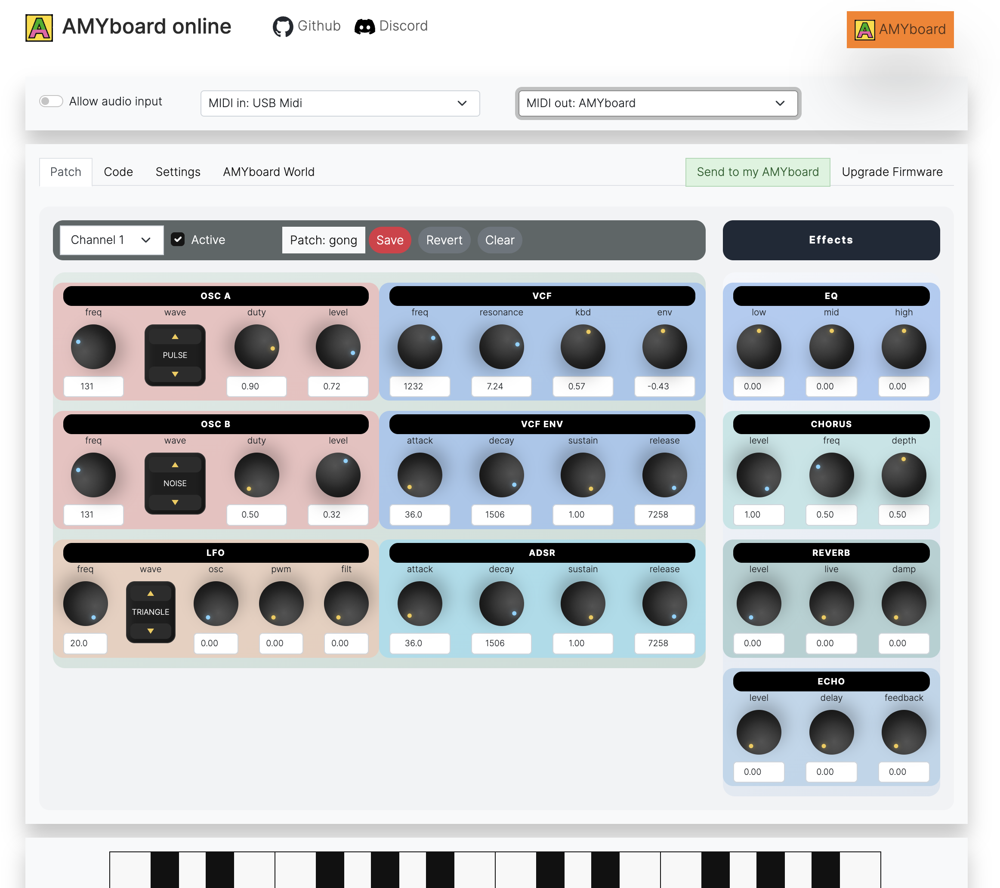

## Getting started

Just open [amyboard.com](https://amyboard.com/editor) in Chrome, Edge, or Firefox (Safari works but MIDI is not available). Click anywhere once on the page to unlock audio, and you're ready to go.

The online editor can be used to both set up a code environment and patches for your AMYboard, or you can just use the site on its own to make music. It can respond to MIDI like a synth, and the sketches you write will work there too. It can't do _everything_ a real AMYboard can - but it's close enough for most things. 

## Play and edit patches

The web editor gives you a knob-per-function interface for Juno-6 and DX7 style patches.

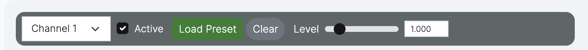

The channel strip runs across the top of the Patch tab and controls which synth channel you're editing.

| Control | Description |
|---------|-------------|
| **Channel 1** (dropdown) | Select which of the 16 independent synth channels to edit. Each channel has its own patch, MIDI assignment, and parameter set. |
| **Active** (checkbox) | Enable or disable this channel. Unchecking it silences the channel without losing its settings. |
| **Patch: None** (button) | Click to open the patch browser and load one of the 256 built-in presets into the current channel. The button shows the name of the currently loaded patch for this channel. |
| **Save** (red button) | Save the current knob values as a named patch. You can recall it later from the patch browser. An asterisk will appear if the patch is "dirty" (has changes that haven't been saved.) |
| **Revert** | Reset the current channel back to the last saved or loaded patch, discarding any unsaved edits. |
| **Clear** | Reset all knobs on this channel to their default values and remove the patch name. |
| **Effects** | The global effects panel (EQ, Chorus, Reverb, Echo). Effects are shared across all channels. |

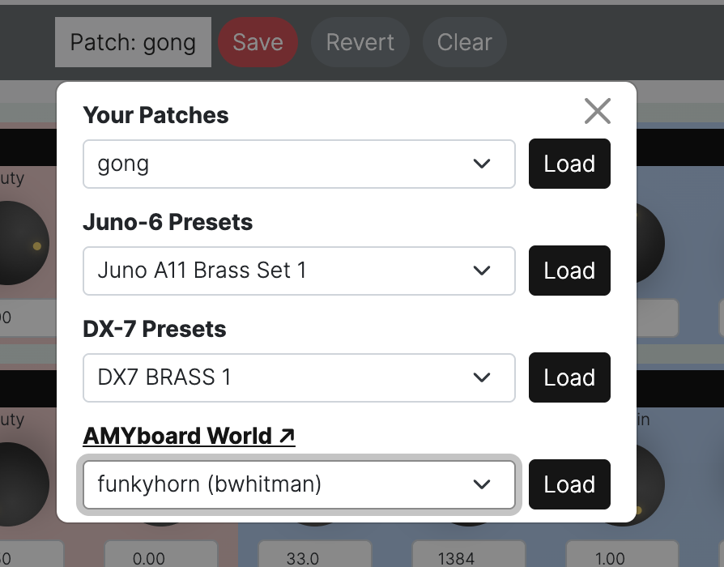

The patch browser lets you load from your own patches, Juno-6 and DX-7 presets, and community patches from AMYboard World.

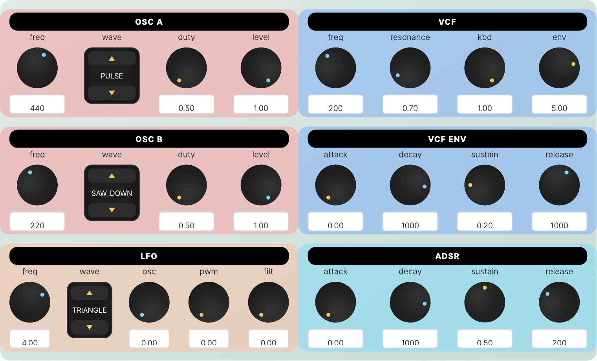

The patch knob panel contains six sections organized into two columns. The left column (pink) controls the oscillators and LFO; the right column (blue) controls the filter and envelopes.

#### OSC A — Oscillator A

| Knob | Description |
|------|-------------|
| **freq** | Base frequency of oscillator A in Hz. Default 440 (concert A). |
| **wave** | Waveform selector. Click to cycle through: SINE, PULSE, SAW\_UP, SAW\_DOWN, TRIANGLE, NOISE, and more. |
| **duty** | Pulse width for PULSE waveform (0–1). Has no effect on other waveforms. |
| **level** | Output level (amplitude) of oscillator A (0–1). |

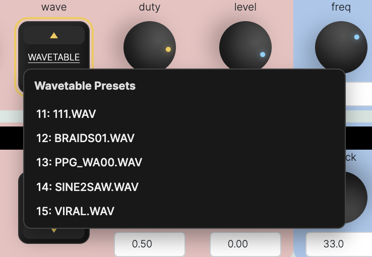

*When you select a wavetable waveform, the Wavetable Presets dropdown lets you choose from built-in wavetable files.*

#### OSC B — Oscillator B

| Knob | Description |
|------|-------------|
| **freq** | Base frequency of oscillator B in Hz. Default 220 (one octave below OSC A). Detune this slightly from OSC A for a thicker sound. |
| **wave** | Waveform selector for oscillator B. Independent of OSC A. |
| **duty** | Pulse width for oscillator B PULSE waveform. |
| **level** | Output level of oscillator B (0–1). |

#### LFO — Low Frequency Oscillator

| Knob | Description |
|------|-------------|
| **freq** | LFO rate in Hz. Typical values are below 10 Hz for vibrato/tremolo effects. |
| **wave** | LFO waveform (TRIANGLE, SINE, SAW, PULSE, etc.). |
| **osc** | How much the LFO modulates oscillator pitch (0–1). Creates vibrato. |
| **pwm** | How much the LFO modulates pulse width of OSC A and B (0–1). Creates pulse-width modulation. |
| **filt** | How much the LFO modulates the VCF cutoff frequency (0–1). Creates filter wobble. |

#### VCF — Voltage-Controlled Filter

| Knob | Description |
|------|-------------|
| **freq** | Filter cutoff frequency in Hz. Lower values make the sound darker/bassier; higher values open the filter. |
| **resonance** | Filter resonance (Q factor, 0–1). Higher values create a sharper peak at the cutoff and can cause clipping. |
| **kbd** | Keyboard tracking amount (0–1). At 1.0, the filter cutoff tracks your MIDI note so higher notes are brighter. |
| **env** | How much the VCF ENV (see below) modulates the filter cutoff. Higher values give more filter sweep per note. Negative values make filter sweep downwards on attack. |

#### VCF ENV — Filter Envelope

| Knob | Description |
|------|-------------|
| **attack** | Time (ms) for the filter envelope to rise to its peak after a note-on. |
| **decay** | Time (ms) for the filter envelope to fall from peak to sustain level. |
| **sustain** | The filter envelope level held while a key is held down (0–1). |
| **release** | Time (ms) for the filter envelope to fall from sustain to zero after note-off. |

#### ADSR — Amplitude Envelope

| Knob | Description |
|------|-------------|
| **attack** | Time (ms) for the note to reach full volume after note-on. |
| **decay** | Time (ms) for the volume to fall from peak to the sustain level. |
| **sustain** | Volume level held while a key is held (0–1). |
| **release** | Time (ms) for the note to fade to silence after note-off. |

If you have a MIDI controller and a browser that supports WebMIDI, AMYboard Online can use it directly:

 - Click the MIDI device selector to choose your input and output devices
 - Play notes on your controller and hear them through AMYboard's synth engine
 - MIDI CC messages can control patch parameters in real time

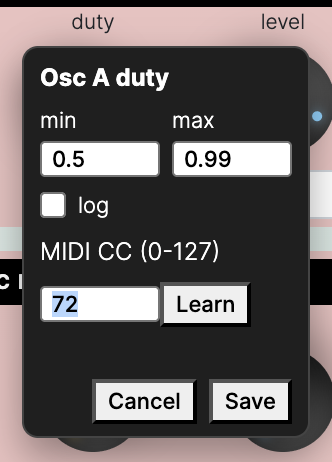

*The knob settings popup showing min/max range, log scaling toggle, and MIDI CC assignment with Learn mode.*

Click any knob **label** (the text above or below the knob, e.g. "freq") to open its parameter editor popup.

| Field | Description |
|-------|-------------|
| **min / max** | The real-world range this knob covers. For example, OSC A freq defaults to min 50 Hz / max 2000 Hz. Tighten this range to make the knob more precise over a smaller span of values. |
| **log** | When checked, the knob follows a logarithmic scale — useful for frequency and time parameters where large values are less perceptually important. |
| **MIDI CC (0-127)** | Assign a MIDI Continuous Controller number to this knob. When your controller sends that CC, the knob moves in real time. |
| **Learn** | Click Learn, then move a knob or fader on your MIDI controller. The CC number is detected automatically and filled in. |
| **Save / Cancel** | Save commits the new range and CC assignment. Cancel closes without changing anything. |

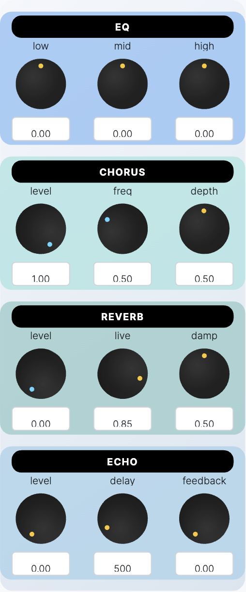

The Effects panel (right side of the Patch tab) contains four global processors shared by all channels.

#### EQ — 3-Band Equalizer

| Knob | Description |
|------|-------------|
| **low** | Low-frequency (\< 800 Hz) shelf gain (dB). Positive boosts bass; negative cuts it. |
| **mid** | Mid-frequency gain (800 - 7000 Hz). |
| **high** | High-frequency (\> 7000 Hz) shelf gain. Positive adds brightness; negative rolls off treble. |

#### Chorus

| Knob | Description |
|------|-------------|
| **level** | Chorus wet/dry mix (0–1). 0 = dry, 1 = full chorus. |
| **freq** | Chorus LFO rate. Higher values give a faster, more intense modulation. |
| **depth** | Chorus depth — how wide the pitch modulation swings. More depth = thicker, swimmy sound. |

#### Reverb

| Knob | Description |
|------|-------------|
| **level** | Reverb wet/dry mix (0–1). |
| **live** | Room size / decay time (0–1). Higher values give a longer, larger-sounding reverb tail. |
| **damp** | High-frequency damping of the reverb tail (0–1). Higher values make the reverb sound warmer and less harsh. |

#### Echo

| Knob | Description |
|------|-------------|
| **level** | Echo wet/dry mix (0–1). |
| **delay** | Echo delay time in milliseconds. |
| **feedback** | How much of the echo signal feeds back into itself (0–1). Higher values create longer, repeating echoes. Keep below 1 to avoid runaway feedback. |

## Write and run Python sketches

When AMYboard starts up, either on web or hardware, it sets up whatever patches are set to each channel (using a file called `editor_state.json` that you can see in the code editor) and then runs a "sketch" set up in `sketch.py`. This is a Python program that runs setup code (in the top level of the code file) and then calls `loop()` periodically (about every 50ms). 

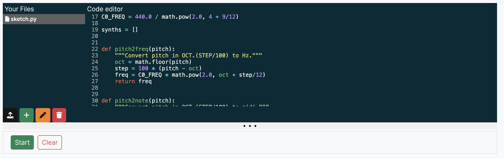

*The Code editor with syntax highlighting, file management, and live execution. Write and edit Python scripts that control AMY directly.*

The code tab of AMYboard online has a code editor. You should see a default `sketch.py` that you can edit. Once you make changes, click the green Start button to re-run the code. The other buttons on the Your Files section are:

 - 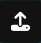 Upload a file from your computer into AMYboard storage
 -  Add a new blank file
 -  Rename an existing file
 -  Delete a file

The code editor auto-saves, so there's no save button. 

Above the code editor is an option "REPL" - a way to interactively type commands into AYMboard online. Remember, this is not directly communicating with your hardware AMYboard, it is talking to the AMYboard emulator running in your web browser. If you want to write code directly on your AMYboard, [see our Python documentation](python.md). 

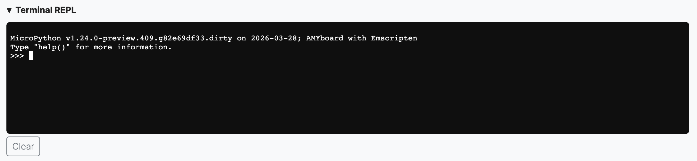

*The Terminal REPL gives you an interactive MicroPython prompt where you can type AMY commands and see results immediately.*

Under the code editor is a row of simulated [AMYboard accessories](accessories.md). This includes an OLED display, a rotary encoder with push button, and two CV input knobs. These help you verify your hardware hookups before deploying to a real AMYboard with acessories.

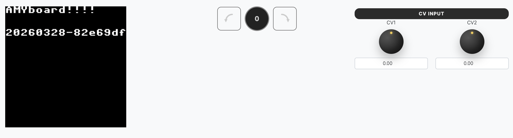

*The hardware interface: OLED display showing firmware info, rotary encoder for patch selection, and CV input knobs for modular integration.*

## Transfer environments to your AMYboard hardware

You can transfer the state of your AMYboard online session directly to a real AMYboard over MIDI SYSEX. You can use either USB MIDI (AMYboard device) or TRS MIDI cable from your own MIDI hardware. 

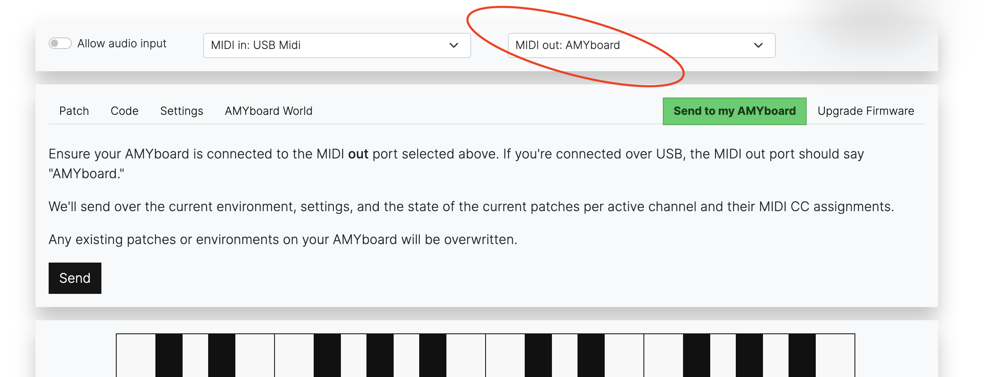

If you have an AMYboard connected via USB:

 1. Click **Send to AMYboard** in the web editor
 2. Make sure your MIDI out (the pull-down menu in the top-right of the editor window) is set your AMYboard! If your AMYboard is connected over USB, MIDI out should say "MIDI out: AMYboard". If you're using TRS MIDI, connect it from your MIDI out port to your AMYboard MIDI in.  *Note:* You may need to quit and reopen your web browser to make it recognize the AMYboard USB MIDI device
 3. Your current patch assignments, modified patches, and any audio files or python files including `sketch.py`  are packed into an archive and transferred over MIDI SysEx
 4. The hardware AMYboard unpacks and applies everything automatically, then reboots

This is the easiest way to set up your hardware AMYboard from a comfortable editing environment.

## AMYboard World

We provide a file sharing network for AMYboard called "AMYboard World." People can share their own environments and patches. It's up to you if you want to share your code with others, but we recommend it! Make sure to join us on our [Discord](https://discord.gg/TzBFkUb8pG) to let people know about your uploads. 

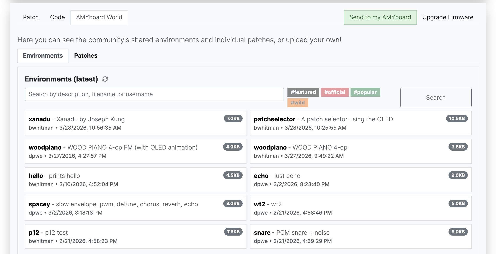

You can search or see everyone's uploaded environments. Enviroments contain everything in the file list -- both patches and code. An online or hardware AMYboard runs a single environment at a time. Click on an environment to replace your current setup with one from AMYboard World. 

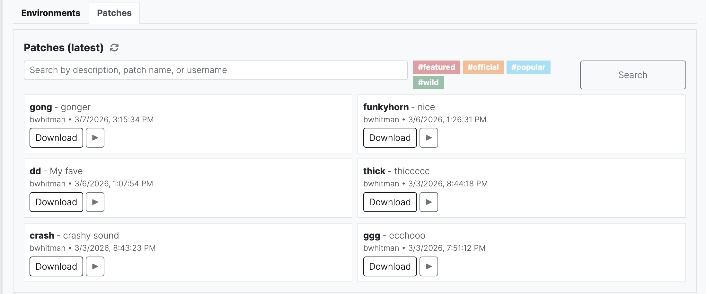

You can also download individual patches for synths from the community. This will just update your current patch settings. You can also preview a few notes of a patch before downloading it.

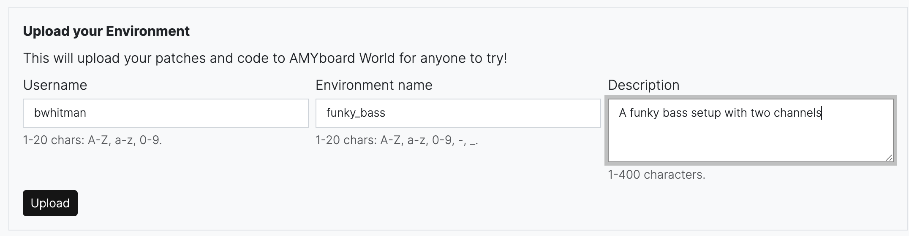

You can upload your own environments or patches here. Choose a memorable username and describe your work!

[Back to Getting Started](README.md)
