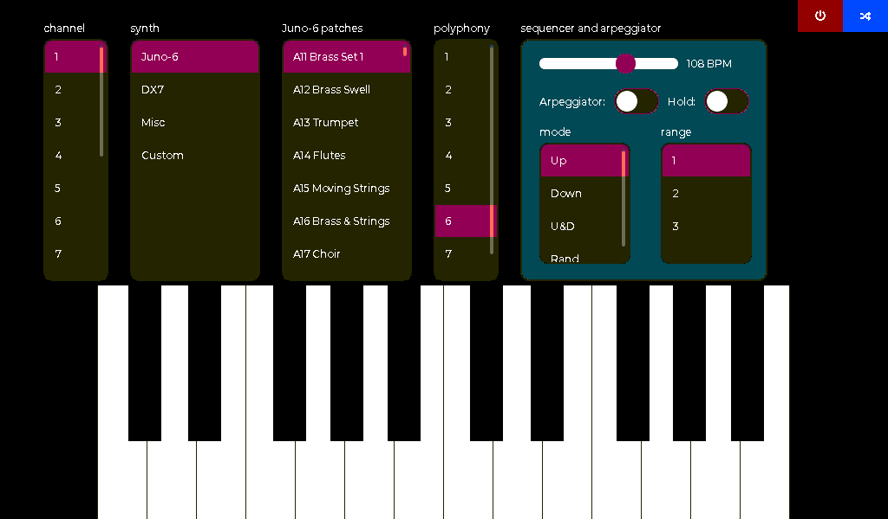

# Using Tulip to make music tutorial

Welcome to Tulip! 

This tutorial shows you all the ways to make music and make code to make music on Tulip. We'll update it as more examples, techniques and demos appear. 

First, make sure you've gone through the initial [getting started tutorial](getting_started.md). Especially, please make sure you've run `tulip.upgrade()`. 

## What Tulip can do with music 

 - Play very accurate Juno-6 patches and similar synths, up to 6 note polyphony / multimbrality. You have full control over all the parameters.
 - Play very accurate DX7 patches, and allow you to create your own FM synthesis setup -- in code!
 - Play built in 808-style drum patches, with pitch control 
 - Load in your own .WAV samples to use in a sampler
 - Control CV outputs for modular synths and analog synths, with built in waveforms and sample & hold 
 - Send MIDI in and out, from code. You can write code to respond to MIDI messages to do whatever you want
 - Share a common sequencer clock across multiple apps, for example, a drum machine and an arpeggiator 
 - Add global EQ, chorus or reverb to the audio output
 - Have total low level control of the oscillators, specifying their filters, waveform, modulation sources, ADSRs

## The built-in Tulip synthesizer

When you start up your Tulip, it is configured to receive MIDI messages from the MIDI in port. You can plug in any MIDI device that sends MIDI out, like a MIDI keyboard or your computer running a sequencer. 

Try to just play notes once you've turned on Tulip, By default, MIDI channel 1 plays a Juno-6 patch. 

You can adjust patch assignments per channel, or change patches, using our built in `voices` app. You can type `run('voices')` or tap the bottom right menu and tap `Voices`. 

The red button on the top right will quit the app, and the blue button will switch to other apps, including the REPL (where you can type commands.)

Try changing the channel 1 patch to a different Juno-6 patch, or a DX-7 patch. You can also tap the keyboard on screen, even with multiple fingers. Try also playing with the arpeggiator. 

import midi
synth = midi.Synth(2) # two voice polyhony
synth.program_change(10) # change to patch #10 (juno-6 patch)
synth.note_on(50, 127)

amy.start_store_patch()
amy.send(osc=0,wave=amy.SINE,chained_osc=1)
amy.send(osc=1,wave=amy.SAW_DOWN, amp="0.1,0,1,1")
amy.stop_store_patch(1024)
amy.send(voices='6', note=52, vel=1, load_patch=1024)

# To save space / RAM, you may want to downsample your WAVE files to 11025 or 22050Hz. We detect SR automatically.
patch = tulip.load_sample("flutea4.wav") # samples are converted to mono if they are stereo

# You can optionally tell us the loop start and end point (in samples), and base MIDI note of the sample.
patch = tulip.load_sample("flutea4.wav", midinote=81, loopstart=1020, loopend=1500)

# The patch number can now be used in the custom Tulip memory PCM sample player. 
# It has all the features of the AMY's PCM wave type.
amy.send(osc=20, wave=amy.CUSTOM, patch=patch, vel=1, note=50)

# You can load up to 32 custom PCM patches. Be careful of memory use. load_sample will return -1 if there's no more room.
# You can unload already allocated patches:
tulip.unload_patch(patch) # frees the RAM and the patch slot
tulip.unload_patch() # frees all allocated PCM patches

To send signals over CV on Tulip CC (hardware only):

amy.send(osc=100, wave=amy.SAW_DOWN, freq=2.5, vel=1, external_channel=1)
# external_channel = 0 - no CV output, will route to audio
# external_channel = 1 - 1st channel of the first connected GP8413
# external_channel = 2 - 2nd channel of the first connected GP8413
# external_channel = 3 - 1st channel of the second connected GP8413
# external_channel = 4 - 2st channel of the second connected GP8413

# Or just send CV signals directly using the m5dac2 library:
import m5dac2
m5dac2.send(volts, channel=0)

import m5adc
volts = m5adc.get()
