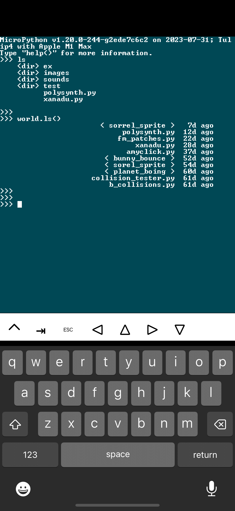

# Tulip Desktop


Tulip Desktop is the desktop computer version of [Tulip CC](../README.md) itself. It supports everything Tulip CC does, and simulates the display and hardware to the best of its ability. It's a great way to learn how to use Tulip or develop for Tulip itself without having to have access to hardware or wait for long flash cycles. 

You can download Tulip Desktop here:

 * [macOS universal build (Apple Silicon & Intel), 10.15 or later](https://github.com/bwhitman/tulipcc/releases/download/v0.2/Tulip_Desktop.dmg)
 * For Linux, see the build instructions below
 * Windows-native build is forthcoming, but it works under WSL using the Linux instructions!

You don't need to compile your own Tulip Desktop unless you're a developer and want to work on Tulip (or on a platform we haven't uploaded a build for.) We regularly upload latest builds of Tulip Desktop for macOS.

## macOS build of Tulip Desktop 

If you want to develop or compile Tulip yourself, start by cloning this repository. 

Then install homebrew

```
# install homebrew first, skip this if you already have it...
/bin/bash -c "$(curl -fsSL https://raw.githubusercontent.com/Homebrew/install/HEAD/install.sh)"
# Then restart your terminal
```

To build Tulip Desktop (macOS 10.15 (Catalina) and higher, Apple Silicon or x86_64):

```
cd tulip/macos
brew install pkg-config libffi

# For local development (just your native arch, and shows stderr in terminal)
./build.sh
./dev/Tulip\ Desktop.app/Contents/MacOS/tulip

# Or package for distribution (creates a universal binary)
./package.sh # makes .app bundle in dist, not necessary if you're just using it locally
```

## Linux build of Tulip Desktop

Install SDL2:

```
# Ubuntu etc
sudo apt install libsdl2-dev libffi-dev

# Fedora etc
sudo yum install SDL2-devel libffi-devel
```

Build and run:

```
cd tulip/linux
./build.sh
./dev/tulip
```

## Windows build of Tulip Desktop

We've heard this works fine under WSL using the Linux instructions. We'd love a native build! 

## iOS (iPad, iPhone) build of Tulip Desktop



Early days, but we're able to boot Tulip (including sound, network, MIDI, display) under iOS. [Check out our build instructions here.](../tulip/ios/README.md) We'd love more help to make this a real thing!


## Questions

Any questions? [Chat with us on our discussions page.](https://github.com/bwhitman/tulipcc/discussions)
