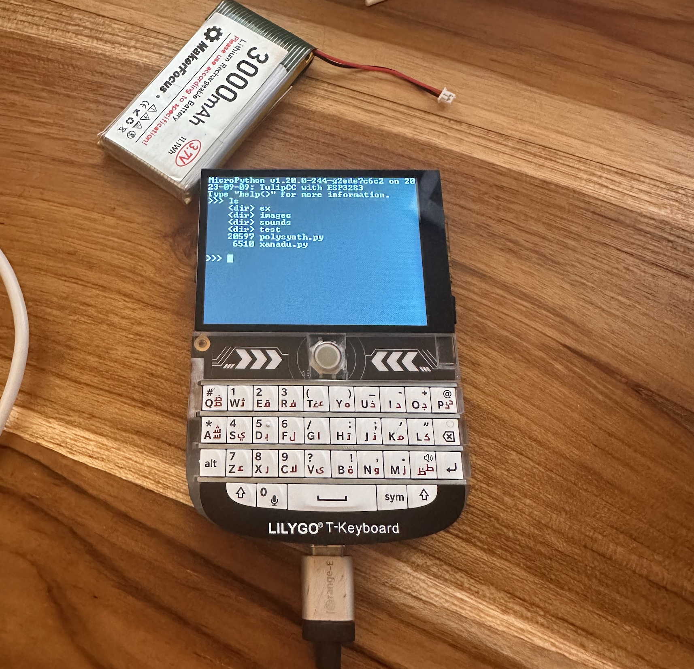

# Tulip for the T-Deck

The [T-Deck](https://www.aliexpress.us/item/3256805505920840.html?gatewayAdapt=glo2usa4itemAdapt) is a ESP32-S3 device with (small) touchscreen, small blackberry-style keyboard, LoRA (optional), speaker, SD card slot, battery charging IC, trackball. The price flucuates but I got the one with LoRA for $60 shipped. It's running a ESP32-S3 N16R8, which meets Tulip CC specs.

I've ported Tulip CC to it and most things work just fine. The screen is 320x240, so you'll only get 40x20 text in the console / editor. The screen is powered by an ST7789 SPI display controller. We're able to use our existing Tulip CC display code as a framebuffer and we blit over DMA each 12-row line of a screen every frame, to reach a very stable 30FPS.

To flash your T-Deck with Tulip, follow the usual [Tulip CC flashing instructions](../../docs/tulip_flashing.md) except be in this directory (`tulipcc/tulip/tdeck`) instead of `tulipcc/tulip/esp32s3`, and don't pass any `MICROPY_BOARD` parameter. 

Notes:

 * They keyboard by default ships with it reporting ASCII codes for each keypress, not any lower-level scan matrix codes. You can re-program the keyboard (it's powered by a separate ESP32-C2) but until then, we're limited to the key combos on the device. I had to cheat to get access to Control-C and Control-X (save in the editor.) Control-C is accessed by pressing right shift and the dollar sign or speaker key (depending on your model), and Control-X is left shift and the 0/microphone key.
 * The trackball is mapped to the arrow keys.
 * USB for MIDI and real keyboard *should* work, but it's annoying to test as the UART for monitoring goes over the same USB connection. There's a header on back for serial monitoring, so I'll eventually move to that and try to get USB working. Alternatively we could use MIDI over the exposed UART pins, but that would require a separate breakout board. 
 * If you get your T-Deck in a state where your computer can't find its USB-Serial connection anymore (probably because you're doing something with USB on Tulip), you have to force it back into bootloader mode before it'll flash again. To do that, flip it off, then hold down the trackball button (GPIO0) while flipping it back on again. The next time you flash, it'll stay in bootloader mode until you hit the "reset" button (opposite side from the power switch.) 

Still todo 

 * Touchscreen support
 * Serial console - you can read but not write to it 
 * USB host support for keyboard and MIDI
 * SD card support
 * LoRA 
 * Battery voltage reporting
 * Reprogram the keyboard

