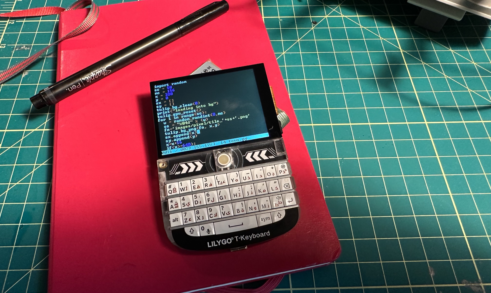
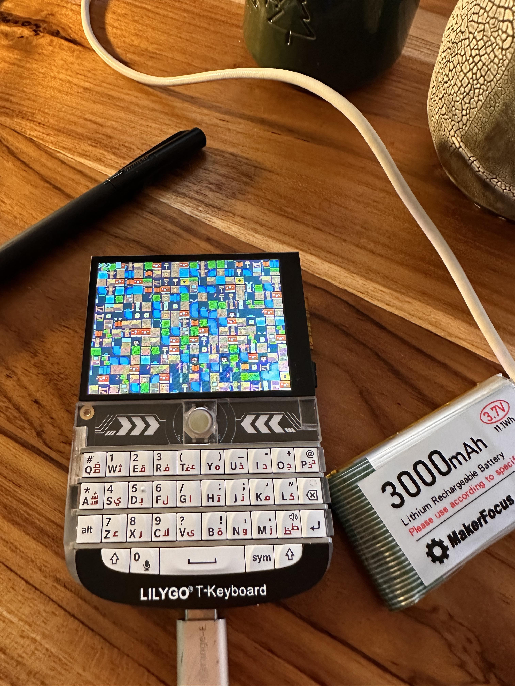
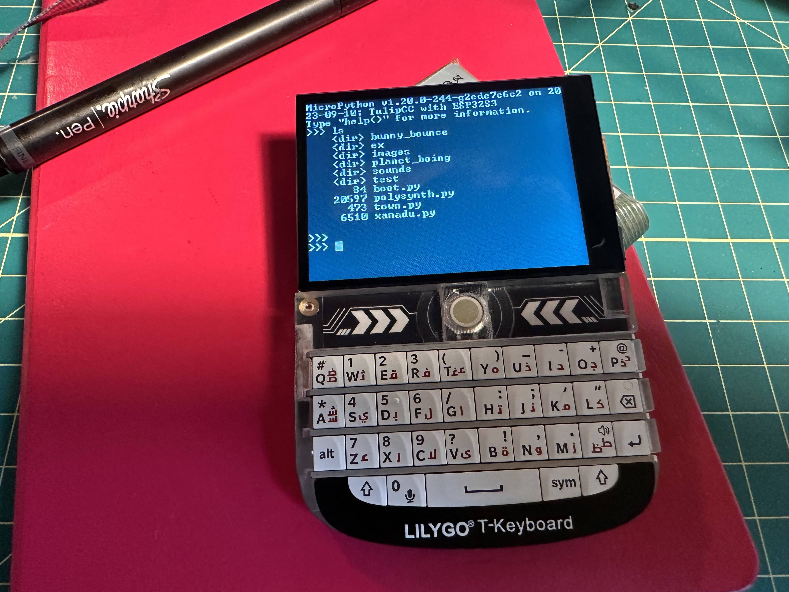

# Tulip for the T-Deck

The [T-Deck](https://www.aliexpress.us/item/3256805505920840.html?gatewayAdapt=glo2usa4itemAdapt) is a ESP32-S3 device with (small) touchscreen, small blackberry-style keyboard, LoRA (optional), speaker, microphone, SD card slot, battery charging IC, trackball. The price flucuates but I got the one with LoRA for $60 shipped. It's running a ESP32-S3 N16R8 (16MB flash, 8MB RAM), which meets Tulip CC specs.

I've ported [Tulip CC](../../README.md) to it and most things work just fine. The screen is 320x240, so you'll only get 53x30 text in the console / editor. The screen is powered by an ST7789 SPI display controller. We're able to use our existing Tulip CC display code as a framebuffer and we blit over DMA each 12-row line of a screen every frame, to reach a very stable 30FPS when everything on the screen changes at once. The synth works fine but is mono only and the speaker can use an upgrade (luckily, it is removable!) You can get [batteries with the smaller JST pins already on](https://www.amazon.com/dp/B08T6GT7DV?ref=ppx_yo2ov_dt_b_product_details&th=1) that fit right in. That and a back case or rubber band and you've got a portable Python "deck" for music, graphics, and games.

To flash your T-Deck with Tulip, follow the usual [Tulip CC flashing instructions](../../docs/tulip_flashing.md) except be in this directory (`tulipcc/tulip/tdeck`) instead of `tulipcc/tulip/esp32s3`, and don't pass any `MICROPY_BOARD` parameter. 

We default the T-Deck to a 6x8 REPL font, to get 53x30 REPL / editor screen instead of 40x20. If this is too small, comment out the `idf_build_set_property(COMPILE_OPTIONS "-DTULIP_REPL_FONT_8X6" APPEND)` line at the end of `CMakeLists.txt` in this folder. 

## Keyboard

They keyboard by default ships with it reporting ASCII codes for each keypress, not any lower-level scan matrix codes, and the Alt key doesn't do anything. You can re-program the keyboard (it's powered by a separate ESP32-C2). It would be great to reprogram this but then others would have to deal with building a flashing jig to reprogram the ESP32-C2, so we may just have to be ok with it. Extra functionality has been provided in micropython to try and make the keyboard more complete.

### Alternate Character Set

An alternate character set can be accessed by pressing `alt+c` (the key with alt written on it, not our alt toggle), this should allow the keyboards character set to be expanded greatly.

| Default   | Alternate | Notes                                     |
|-----------|-----------|-------------------------------------------|
| `q`       | `~`       |                                           |
| `w`       | `&`       |                                           |
| `e`       | `\|`      |                                           |
| `r`       | `%`       |                                           |
| `t`       | `{`       |                                           |
| `y`       | `}`       |                                           |
| `u`       | `^`       |                                           |
| `i`       | `<`       |                                           |
| `o`       | `>`       |                                           |
| `p`       | `=`       |                                           |
| `a`       | `¬`       | Prints nothing but should be a ¬ sign     |
| `g`       | `\`       |                                           |
| `k`       | `` ` ``   |                                           |
| `$`       | `£`       | Prints nothing but should be a £ sign     |
| `<space>` | `<tab>`   |                                           |
| `(`       | `[`       | Requires symbol to be pressed after alt+c |
| `)`       | `]`       | Requires symbol to be pressed after alt+c |

### Ctrl Toggle

A `ctrl` key toggle has been created, to enable it press `shift+0` together and then release them, now presss any configured letter and then `enter`. The shortcut will be sent to the running program/REPL and the toggle will be deactivated. 

| Key       | Action                         | Notes                   |
|-----------|--------------------------------|-------------------------|
| `q`       | Device Control 1               |                         |
| `w`       | End of Transmission Block      |                         |
| `e`       | Enquiry Character              | Paste mode              |
| `r`       | Device Control 2               |                         |
| `t`       | Device Control 4               |                         |
| `y`       | End of Medium                  |                         |
| `u`       | Negative Acknowledge Character |                         |
| `i`       | Horizontal Tab                 |                         |
| `o`       | Shift In                       |                         |
| `p`       | Data Link Escape               |                         |
| `a`       | Start of Heading               | Enter raw REPL          |
| `s`       | Device Control 3               |                         |
| `d`       | End of Transmission Character  | Micropython soft reboot |
| `f`       | Acknowledge Character          |                         |
| `g`       | Bell Character                 |                         |
| `h`       | Backspace Character            |                         |
| `j`       | Linefeed Character             |                         |
| `k`       | Vertical Tab                   |                         |
| `l`       | Formfeed                       |                         |
| `z`       | Substitute Character           |                         |
| `x`       | Cancel Character               |                         |
| `c`       | End of Text Character          | Keyboard interrupt      |
| `v`       | Synchronous Idle               |                         |
| `b`       | Start of Text                  | Exit raw REPL           |
| `n`       | Shift Out                      |                         |
| `m`       | Carriage Return                |                         |
| `$`       | Delete Character               |                         |
| `<space>` | Escape Character               |                         |

### Alt toggle

An `alt` key toggle has been created, to enable it press `shift+$` together and then release them, now presss any configured letter and then `enter`. The shortcut will be sent to the running program/REPL and the toggle will be deactivated. Alt-keycodes can be sent to the REPL by enabling the toggle with `shift+$`, then pressing `sym` before choosing a number, the `sym` key must be pressed before each digit, once the number is completed hit enter to send it to the REPL and disable the toggle. For example, to print a `$` symbol which is the 36th ASCII/Unicode character press the following keys in order: `shift+$` + `sym` + `3` + `sym` + `6` + `<enter>`.

| Key | Action       | Notes |
|-----|--------------|-------|
| `e` | Up Key       |       |
| `x` | Down Key     |       |
| `s` | Left Key     |       |
| `f` | Right Key    |       |

## Notes

* The trackball is mapped to the arrow keys.
* USB for MIDI and real keyboard *should* work, but it's annoying to test as the UART for monitoring goes over the same USB connection. There's a header on back for serial monitoring, so I'll eventually move to that and try to get USB working. Alternatively we could use MIDI over the exposed UART pins, but that would require a separate breakout board. 
* If you get your T-Deck in a state where your computer can't find its USB-Serial connection anymore (probably because you're doing something with USB on Tulip), you have to force it back into bootloader mode before it'll flash again. To do that, flip it off, then hold down the trackball button (GPIO0) while flipping it back on again. You can let go of the ball right after you flip it on. The next time you flash, it'll stay in bootloader mode until you hit the "reset" button (opposite side from the power switch.) If you're trying to connect to the monitor, you'll see "waiting for download" -- that's your hint to hit the reset button.
* Someone _could_ update the display code to variably refresh based on which parts of the screen was changing, as the S7789 has its own screen refresh RAM. But it may not be worth it. By default we refresh the entire screen every frame and achieve 30FPS using a 80MHz clock. 

## Still todo 

* Touchscreen support
* ~~Serial console - you can read but not write to it~~ 
* USB host support for keyboard and MIDI
* SD card support
* LoRA 
* Battery voltage reporting
* ~~Expand onboard keyboard functionality~~
* Microphone support 
* Try 120MHz SPI 

